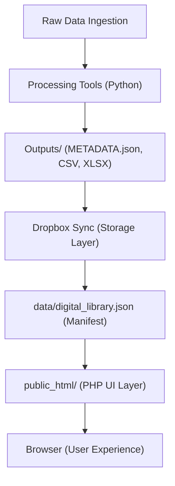

# TITAN: System Architecture Overview

This document describes the flow of data from ingestion to public display on `central.enterprises`.

## 1. High-Level Data Flow

## 2. Core Components

### Data Processing (`PythonTools/`)

- **`process_data.py`**: The engine that transforms raw data into structured outputs.
- **`sitemap_generator.py`**: Ensures SEO searchability of all processed assets.

### Governance & Manifests (`data/`)

- **`digital_library.json`**: The **Single Source of Truth** for all active datasets, metrics, and download links.

### Presentation Layer (`public_html/`)

- **`country/index.php`**: The dynamic landing page engine that aggregates manifest data and sector metadata.
- **`assets/titan.css`**: The design system authority.

## 3. Infrastructure

- **Web Server**: Nginx (Oracle Cloud Ubuntu 22.04).
- **Automation**: Systemd services for API layers and Cron for self-healing permissions.
